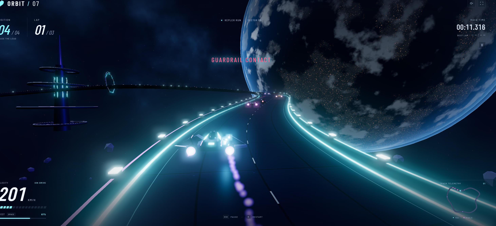
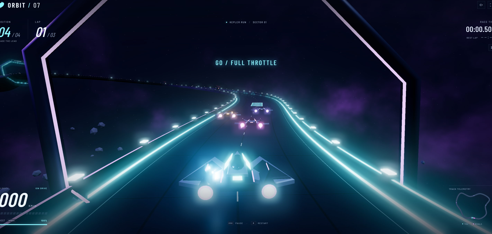
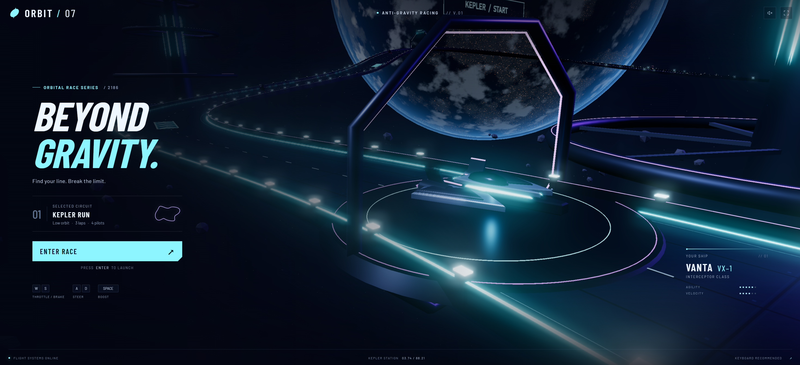

# ORBIT / 07

A fast browser-based anti-gravity racing game built with Three.js.

## [▶ PLAY NOW](https://tacdelgineer.github.io/orbit-07/)



## Features

- Anti-gravity arcade racing against three AI opponents
- Boost pads, hazards, and sequential checkpoints
- Three-lap races with position, timer, minimap, and results HUD
- Procedural ships and orbital scenery with neon trails and bloom
- Pause, restart, keyboard controls, and touch controls



## Controls

| Key | Action |
| --- | --- |
| W / Up | Accelerate |
| S / Down | Brake |
| A / D or Left / Right | Steer |
| Space | Boost |
| Esc | Pause / resume |
| R | Restart |
| M | Toggle audio |

## Run locally

Requires Node.js 22.13 or newer.

```sh
git clone https://github.com/Tacdelgineer/orbit-07.git
cd orbit-07
npm ci
npm run dev
```

Open the URL printed in the terminal. The root route hosts the game, and `/game/index.html` opens the standalone static version.

## Production build

```sh
npm test
npm run build
```

The simulation tests run without a browser. A manual WebGL 2 browser play-through is still recommended for rendering or gameplay changes.

## Deploy

Pushes to `main` automatically test, build, and deploy `public/game` with [the GitHub Pages workflow](.github/workflows/deploy-pages.yml). The deployed files use relative URLs so they remain compatible with the `/orbit-07/` repository base path.

## Project structure

```text
app/                       Vinext host for local development
public/game/index.html     Standalone game and UI markup
public/game/js/            Race simulation, rendering, input, HUD, and audio
public/game/styles.css     Game presentation and responsive layout
public/game/vendor/        Browser-ready Three.js modules and license
tests/race.test.mjs        Deterministic simulation tests
.github/workflows/         GitHub Pages deployment
AGENTS.md                  Operating guide for coding agents
```



### Run or modify with a coding agent

Copy and paste this prompt:

> You are working with the ORBIT / 07 repository. Read `README.md` and `AGENTS.md` before changing anything. Use Node.js 22.13 or newer, install dependencies with `npm ci`, start the project with `npm run dev`, and verify the game locally. Preserve the existing Three.js architecture, procedural assets, and racing behavior unless I explicitly request gameplay changes. Keep all browser asset URLs compatible with the GitHub Pages `/orbit-07/` base path. After modifications, run `npm test` and `npm run build`. Report the local URL, test/build status, files changed, and remaining issues.

## License

No project license has been selected. Three.js is redistributed under its MIT license in [`public/game/vendor/LICENSE`](public/game/vendor/LICENSE).
